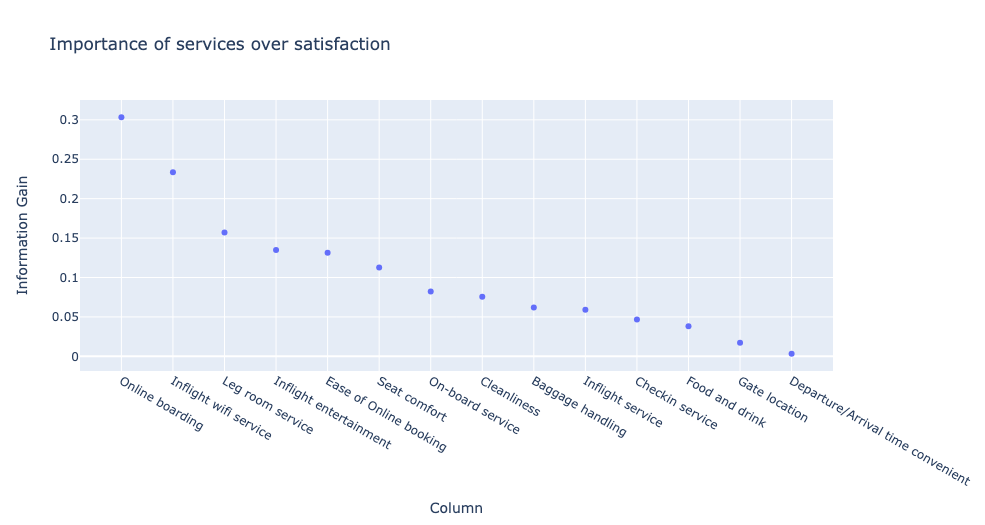
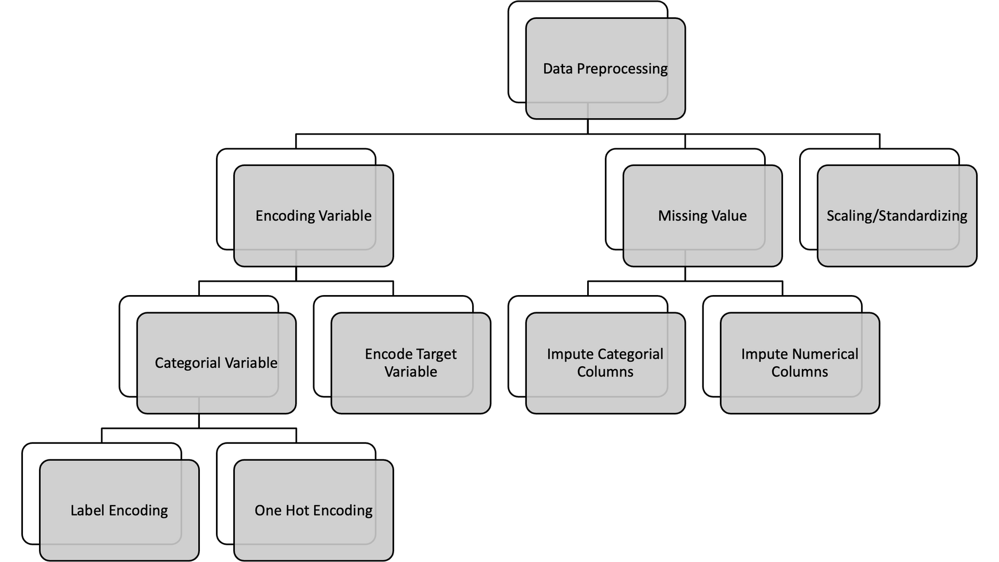
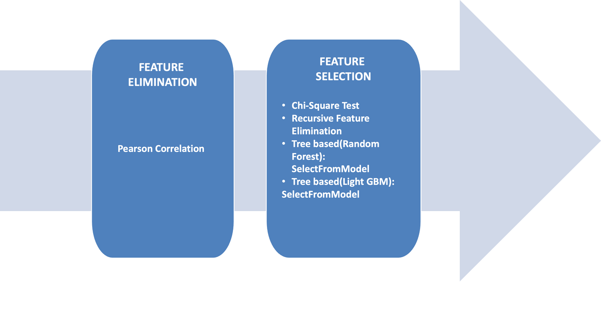

+-----------------------------------+-----------------------------------+
|   ------------------------------  |                                   |
|   AIRLINE PASSENGER SATISFACTION  |                                   |
|   ------------------------------  |                                   |
|                                   |                                   |
|   ------------------------------  |                                   |
+===================================+===================================+
| > Team Project : Group 1          | Date : 26th September 2023        |
+-----------------------------------+-----------------------------------+

{width="24.12361111111111in"
height="13.569530839895013in"}

+-----------+-----------+-----------+-----------+-----------+-----------+
| > !       | **01**    | **02**    | AGENDA    | **03**    | > **04**  |
| { |           |           |           |           |           |
| width="1. |           |           |           |           |           |
| 386111111 |           |           |           |           |           |
| 111111in" |           |           |           |           |           |
| > hei     |           |           |           |           |           |
| ght="0.92 |           |           |           |           |           |
| 638888888 |           |           |           |           |           |
| 88889in"} |           |           |           |           |           |
+===========+===========+===========+===========+===========+===========+
+-----------+-----------+-----------+-----------+-----------+-----------+

+-----------------+-----------------+-----------------+-----------------+
| Problem         | Story Telling   | > Data          | > Baseline      |
| Statement &     |                 | > Preprocessing | > Model         |
+=================+=================+=================+=================+
| Feature         |                 |                 |                 |
| Description     |                 |                 |                 |
+-----------------+-----------------+-----------------+-----------------+
| **05**          | **06**          | **07**          | > **08**        |
+-----------------+-----------------+-----------------+-----------------+

  -----------------------------------------------------------------------
  Hyperparameter    Feature Selection Model Fit Check   Conclusion
  ----------------- ----------------- ----------------- -----------------
  Tuning                                                

  -----------------------------------------------------------------------

{width="1.7291666666666667in"
height="0.9680555555555556in"}

> {width="1.386111111111111in"
> height="0.9263888888888889in"}
>
> [PROBLEM STATEMENT & FEATURE DESCRIPTION]{.underline}

+-----------------------------------+-----------------------------------+
| {width="1.2597211286089238in" | > satisfaction in the airline     |
| height="0.8958333333333334in"}    | > industry based on a             |
|                                   | > comprehensive set of            |
|                                   | > traveler-related and            |
|                                   | > service-related factors.        |
+===================================+===================================+
+-----------------------------------+-----------------------------------+

> This model aims to uncover the primary drivers of satisfaction and
> assist airlines in enhancing the overall travel experience.

+-----------------------------------+-----------------------------------+
|   ----------------------------    | > This dataset contains a         |
| --------------------------------- | > satisfaction survey of          |
| --------------------------------- | > passengers who travel in        |
|   {width="0.9472222222222222in" |                                   |
|   height="1.198611111111111in"}   |                                   |
|   ----------------------------    |                                   |
| --------------------------------- |                                   |
| --------------------------------- |                                   |
|                                   |                                   |
|   ----------------------------    |                                   |
| --------------------------------- |                                   |
| --------------------------------- |                                   |
+===================================+===================================+
+-----------------------------------+-----------------------------------+

{width="1.7291666666666667in"
height="0.9680555555555556in"}

+-----------------------------------+-----------------------------------+
| > {width="1.386111111111111in" | png){width="14.780555555555555in" |
| > height="0.9263888888888889in"}  | > height="9.854166666666666in"}   |
|                                   |                                   |
| {width="1.7291666666666667in" |                                   |
| height="0.9680555555555556in"}    |                                   |
+===================================+===================================+
+-----------------------------------+-----------------------------------+

{width="1.7291666666666667in"
height="0.9726563867016623in"}

+-----------------------+-----------------------+-----------------------+
| > {width=" |                       |                       |
| 1.1777777777777778in" |                       |                       |
| > height="0           |                       |                       |
| .7916666666666666in"} |                       |                       |
+=======================+=======================+=======================+
| {width= |                       | a/image8.png){width=" |
| "9.405555555555555in" |                       | 10.208333333333334in" |
| height="              |                       | > height="5.4375in"}  |
| 5.509722222222222in"} |                       |                       |
+-----------------------+-----------------------+-----------------------+

+-----------------------+-----------------------+-----------------------+
| > \"Business          | > \"Dissatisfaction   | > \"Dissatisfaction   |
| > travelers in\       | > is notable among    | > among Economy class |
| > Business class      | > Economy class       | > business travelers  |
| > exhibit high        | > personal travelers, | > suggests an         |
| > satisfaction,       | > emphasizing the     | > opportunity to      |
| > reflecting the\     | > need to enhance     | > promote\            |
| > company\'s          | > their experience    | > Business class      |
| > effective catering  | > for improved\       | > benefits while\     |
| > to this segment.\"  | > satisfaction and    | > addressing cost     |
|                       | > loyalty.\"          | > concerns.\"         |
+=======================+=======================+=======================+
+-----------------------+-----------------------+-----------------------+

+-----------------------------------+-----------------------------------+
| > {width="1.1777777777777778in" | > \"Longer delays lead to a       |
| > height="0.7916666666666666in"}  | > noticeable dip in satisfaction. |
|                                   | > Punctuality is key!\"\          |
|                       |
| 362abd71d045283c3a0/media/image9. | >                                 |
| png){width="12.269444444444444in" | > \"Endurance Test: Flights       |
| height="10.2in"}                  | > exceeding\                      |
|                                   | > 4000km tend to result in        |
|                                   | > dissatisfaction.                |
|                                   | >                                 |
|                                   | > Comfort and services for        |
|                                   | > long-haul need reevaluation.\"  |
|                                   | >                                 |
|                                   | > \"Age plays a role: Younger and |
|                                   | > Older travelers may have higher |
|                                   | > expectations or vice-versa.\"\  |
|                                   | > (\<20 and \>60)                 |
+===================================+===================================+
+-----------------------------------+-----------------------------------+

{width="2.4583333333333335in"
height="1.3828127734033246in"}{width="14.145833333333334in"
height="7.539657699037621in"}{width="17.77777777777778in"
height="2.9583333333333335in"}

+-----------------------------------+-----------------------------------+
| > {width="1.1777777777777778in" |                                   |
| > height="0.7916666666666666in"}  |                                   |
+===================================+===================================+
+-----------------------------------+-----------------------------------+

> *\"Addressing these*\
> *key services, even*\
> *with small*\
> *incremental changes,*\
> *can lead to a*\
> *significant leap in*\
> *overall satisfaction.\"*
>
> Excelling in boarding and inflight WiFi can greatly elevate passenger
> satisfaction.
>
> Comfort during the journey, especially legroom, plays a pivotal role.
>
> Entertainment and seamless booking processes are integral to a
> complete experience.

+-----------------------------------+-----------------------------------+
| > {width="1.386111111111111in" |                                   |
| > height="0.9263888888888889in"}  |                                   |
+===================================+===================================+
+-----------------------------------+-----------------------------------+

> {width="13.844444444444445in"
> height="7.791666666666667in"}

{width="1.7291666666666667in"
height="0.9680555555555556in"}

+-----------------------------------+-----------------------------------+
| > {width="1.386111111111111in" |                                   |
| > height="0.9263888888888889in"}  |                                   |
+===================================+===================================+
+-----------------------------------+-----------------------------------+

  ----------------------------------------------------------------------------------------
              Model            Accuracy       Precision      Recall         F1 Score
  ----------- ---------------- -------------- -------------- -------------- --------------
  **1**       **Logistic       0.874192       0.869698       0.835637       0.852327
              Regression**                                                  

  **2**       **DecisionTree   0.946412       0.936628       0.940280       0.938451
              Classifier**                                                  

  **3**       **RandomForest   **0.962119**   **0.971099**   **0.940812**   **0.955716**
              Classifier**                                                  

  **4**       **Stochastic     0.870958       0.853124       0.849194       0.851155
              Gradient                                                      
              Descent**                                                     

  **5**       **Support Vector 0.944949       0.947025       0.925040       0.935903
              Machine**                                                     
  ----------------------------------------------------------------------------------------

{width="1.7291666666666667in"
height="0.9680555555555556in"}

{width="9.020833333333334in"
height="5.1386537620297466in"}

+-----------------------------------+-----------------------------------+
| > {width="1.386111111111111in" | | Model** | *Params | P       |   |
| > height="0.9263888888888889in"}  | |         | Grid**  | arams** |   |
| >                                 | +=========+=========+=========+   |
| > HYPER PARAMETER TUNNING\        | | **L     | > {\    | {\'C\': |   |
| > USING\                          | | ogistic | >       | 0.5,    |   |
| > GRID SEARCH                     | | Regre   |  \"C\": | \'max_  |   |
|                                   | | ssion** | >       | iter\': |   |
| {width="1.7291666666666667in" | |         | >       |         |   |
| height="0.9680555555555556in"}    | |         |  10\],\ |         |   |
|                                   | |         | >       |         |   |
|                                   | |         |  \"max_ |         |   |
|                                   | |         | iter\": |         |   |
|                                   | |         | >       |         |   |
|                                   | |         |  \[500, |         |   |
|                                   | |         | >       |         |   |
|                                   | |         | 1000\]\ |         |   |
|                                   | |         | > }     |         |   |
|                                   | +---------+---------+---------+   |
|                                   | | **Decis | > {     | > {     |   |
|                                   | | ionTree | \'max_d | \'crite |   |
|                                   | | Class   | epth\': | rion\': |   |
|                                   | | ifier** | > \[2,  | >       |   |
|                                   | |         | >       | \'log_l |   |
|                                   | |         |  20\],\ | oss\',\ |   |
|                                   | |         | >       | >       |   |
|                                   | |         | \'min_s | \'max_d |   |
|                                   | |         | amples_ | epth\': |   |
|                                   | |         | leaf\': | > 20,\  |   |
|                                   | |         | > \[2,  | > \'max |   |
|                                   | |         | > 10,   | _leaf_n |   |
|                                   | |         | > 100,  | odes\': |   |
|                                   | |         | >       | >       |   |
|                                   | |         | 1000\], |  1000,\ |   |
|                                   | |         | >       | > \'min |   |
|                                   | |         | \'crite | _impuri |   |
|                                   | |         | rion\': | ty_decr |   |
|                                   | |         | > \[    | ease\': |   |
|                                   | |         | \'gini\ | >       |   |
|                                   | |         | ',\'ent | 0.0001, |   |
|                                   | |         | ropy\', | >       |   |
|                                   | |         | > \     | \'min_s |   |
|                                   | |         | 'log_lo | amples_ |   |
|                                   | |         | ss\'\], | leaf\': |   |
|                                   | |         | > \'max | > 2,\   |   |
|                                   | |         | _leaf_n | >       |   |
|                                   | |         | odes\': |  \'spli |   |
|                                   | |         | > \[10, | tter\': |   |
|                                   | |         | > 100,  | > \'    |   |
|                                   | |         | > 1     | best\'} |   |
|                                   | |         | 000\],\ |         |   |
|                                   | |         | > \'min |         |   |
|                                   | |         | _impuri |         |   |
|                                   | |         | ty_decr |         |   |
|                                   | |         | ease\': |         |   |
|                                   | |         | > \[0.  |         |   |
|                                   | |         | 000001, |         |   |
|                                   | |         | >       |         |   |
|                                   | |         | 0.0001, |         |   |
|                                   | |         | >       |         |   |
|                                   | |         |  0.001, |         |   |
|                                   | |         | > 0.    |         |   |
|                                   | |         | 010\],\ |         |   |
|                                   | |         | >       |         |   |
|                                   | |         |  \'spli |         |   |
|                                   | |         | tter\': |         |   |
|                                   | |         | > \[\'  |         |   |
|                                   | |         | best\', |         |   |
|                                   | |         | >       |         |   |
|                                   | |         |  \'rand |         |   |
|                                   | |         | om\'\]} |         |   |
|                                   | +---------+---------+---------+   |
|                                   | | **Rando | > {\    | > {     |   |
|                                   | | mForest | > \"n   | \'crite |   |
|                                   | | Class   | _estima | rion\': |   |
|                                   | | ifier** | tors\": | >       |   |
|                                   | |         | >       | \'log_l |   |
|                                   | |         |  \[400, | oss\',\ |   |
|                                   | |         | >       | >       |   |
|                                   | |         | 500\],\ | \'max_d |   |
|                                   | |         | >       | epth\': |   |
|                                   | |         | \"crite | > 25,\  |   |
|                                   | |         | rion\": | > \     |   |
|                                   | |         | > \[\"  | 'min_sa |   |
|                                   | |         | gini\", | mples_s |   |
|                                   | |         | > \"ent | plit\': |   |
|                                   | |         | ropy\", | > 2,\   |   |
|                                   | |         | > \     | > \'n   |   |
|                                   | |         | "log_lo | _estima |   |
|                                   | |         | ss\"\], | tors\': |   |
|                                   | |         | >       | > 500}  |   |
|                                   | |         | \"max_d |         |   |
|                                   | |         | epth\": |         |   |
|                                   | |         | > \[20, |         |   |
|                                   | |         | > 25,   |         |   |
|                                   | |         | >       |         |   |
|                                   | |         |  32\],\ |         |   |
|                                   | |         | > \     |         |   |
|                                   | |         | "min_sa |         |   |
|                                   | |         | mples_s |         |   |
|                                   | |         | plit\": |         |   |
|                                   | |         | > \[1,  |         |   |
|                                   | |         | > 2\]\  |         |   |
|                                   | |         | > }     |         |   |
|                                   | +---------+---------+---------+   |
|                                   | | > **Sto | > {\    | > {\'a  |   |
|                                   | | chastic | > \"    | lpha\': |   |
|                                   | | > G     | loss\": | >       |   |
|                                   | | radient | > \[\"h | 0.001,\ |   |
|                                   | | > De    | inge\", | > \'    |   |
|                                   | | scent** | > \     | loss\': |   |
|                                   | |         | "log_lo | > \'hi  |   |
|                                   | |         | ss\"\], | nge\',\ |   |
|                                   | |         | >       | > \'pen |   |
|                                   | |         | \"penal | alty\': |   |
|                                   | |         | ty\":\[ | >       |   |
|                                   | |         | \"l2\", | \'l2\'} |   |
|                                   | |         | >       |         |   |
|                                   | |         | \"l1\", |         |   |
|                                   | |         | > \"e   |         |   |
|                                   | |         | lasticn |         |   |
|                                   | |         | et\"\], |         |   |
|                                   | |         | > \"a   |         |   |
|                                   | |         | lpha\": |         |   |
|                                   | |         | > \[    |         |   |
|                                   | |         | 0.0001, |         |   |
|                                   | |         | >       |         |   |
|                                   | |         |  0.001, |         |   |
|                                   | |         | >       |         |   |
|                                   | |         | 0.1,0.5 |         |   |
|                                   | |         | > \] }  |         |   |
|                                   | +---------+---------+---------+   |
|                                   | | **      | > {\    | >       |   |
|                                   | | Support | >       | {\'C\': |   |
|                                   | | Vector  |  \"C\": | > 10,\  |   |
|                                   | | Ma      | > \[1,  | > \'ke  |   |
|                                   | | chine** | > 5,    | rnel\': |   |
|                                   | |         | >       | > \     |   |
|                                   | |         |  10\],\ | 'rbf\'} |   |
|                                   | |         | > \"ke  |         |   |
|                                   | |         | rnel\": |         |   |
|                                   | |         | >       |         |   |
|                                   | |         |  \[\"li |         |   |
|                                   | |         | near\", |         |   |
|                                   | |         | > \"rb  |         |   |
|                                   | |         | f\"\],\ |         |   |
|                                   | |         | > }     |         |   |
|                                   | +---------+---------+---------+   |
+===================================+===================================+
+-----------------------------------+-----------------------------------+

> HYPER PARAMETER TUNNING RESULTS

+-------------+-------------+-------------+-------------+-------------+
| **Model**   | *           | **          | **Recall**  | *           |
|             | *Accuracy** | Precision** |             | *F1_score** |
+=============+=============+=============+=============+=============+
| Basline     | 0.874115    | 0.870015    | 0.835017    | 0.852157    |
| Logistic    |             |             |             |             |
| Regression  |             |             |             |             |
+-------------+-------------+-------------+-------------+-------------+
| Baseline    | 0.946682    | 0.936591    | 0.940989    | 0.938785    |
| D           |             |             |             |             |
| ecisionTree |             |             |             |             |
| Classifier  |             |             |             |             |
+-------------+-------------+-------------+-------------+-------------+
| Baseline    | 0.962388    | 0.971808    | 0.940723    | 0.956013    |
| R           |             |             |             |             |
| andomForest |             |             |             |             |
| Classifier  |             |             |             |             |
+-------------+-------------+-------------+-------------+-------------+
| Baseline    | 0.876732    | 0.880531    | 0.828726    | 0.853843    |
| Stochastic  |             |             |             |             |
| Gradient    |             |             |             |             |
| Descent     |             |             |             |             |
+-------------+-------------+-------------+-------------+-------------+
| Baseline    | 0.945180    | 0.946244    | 0.926458    | 0.936246    |
| Support     |             |             |             |             |
| Vector      |             |             |             |             |
| Machine     |             |             |             |             |
+-------------+-------------+-------------+-------------+-------------+
| **Parameter | *           | *           | *           | *           |
| Tuned       | *0.874076** | *0.869730** | *0.835283** | *0.852158** |
| Logistic    |             |             |             |             |
| R           |             |             |             |             |
| egression** |             |             |             |             |
+-------------+-------------+-------------+-------------+-------------+
| **Parameter | *           | *           | *           | *           |
| Tuned       | *0.957499** | *0.969217** | *0.931774** | *0.950126** |
| D           |             |             |             |             |
| ecisionTree |             |             |             |             |
| R           |             |             |             |             |
| egression** |             |             |             |             |
+-------------+-------------+-------------+-------------+-------------+
| **Parameter | *           | *           | *           | *           |
| Tuned       | *0.962465** | *0.972678** | *0.940014** | *0.956067** |
| R           |             |             |             |             |
| andomForest |             |             |             |             |
| C           |             |             |             |             |
| lassifier** |             |             |             |             |
+-------------+-------------+-------------+-------------+-------------+
| >           | *           | *           | *           | *           |
| **Parameter | *0.876771** | *0.896129** | *0.810296** | *0.851054** |
| > Tuned     |             |             |             |             |
| >           |             |             |             |             |
|  Stochastic |             |             |             |             |
| > Gradient  |             |             |             |             |
| > Descent** |             |             |             |             |
+-------------+-------------+-------------+-------------+-------------+
| **Parameter | *           | *           | *           | *           |
| Tuned       | *0.955035** | *0.959742** | *0.935761** | *0.947600** |
| Support     |             |             |             |             |
| Vector      |             |             |             |             |
| Machine**   |             |             |             |             |
+-------------+-------------+-------------+-------------+-------------+

> {width="1.386111111111111in"
> height="0.9263888888888889in"}{width="8.1875in"
> height="7.8821194225721785in"}

FEATURE SELECTION METHODS

> {width="10.0in"
> height="5.1777766841644794in"}
>
> Highly correlated columns: \[\"Departure Delay in minutes\", \"Arrival
> Delay in minutes\"\]
>
> �A high correlation between independent variables can diminish model
> accuracy because

+-----------------------------------+-----------------------------------+
| > both columns essentially convey |                                   |
| > redundant information.          |                                   |
| > Therefore, it is advisable to   |                                   |
| > remove                          |                                   |
+===================================+===================================+
| {width="1.7291666666666667in" |                                   |
| height="0.9680555555555556in"}    |                                   |
+-----------------------------------+-----------------------------------+

> {width="1.1777777777777778in"
> height="0.7916666666666666in"}

+-----------------------+-----------------------+-----------------------+
| +--------+--------+   | +--------+--------+   | +--------+--------+   |
| | > ![]  | > Des  |   | | > ![   | > Cus  |   | | > ![]  | >      |   |
| | (verto | cribes |   | | ](vert | tomers |   | | (verto |  WI-FI |   |
| | pal_f5 | > the  |   | | opal_f | > Who  |   | | pal_f5 | > s    |   |
| | 788db0 | >      |   | | 5788db | > give |   | | 788db0 | ervice |   |
| | 4ed743 | actual |   | | 04ed74 | > re   |   | | 4ed743 | > ava  |   |
| | 62abd7 | > age  |   | | 362abd | peated |   | | 62abd7 | ilable |   |
| | 1d0452 | > of   |   | | 71d045 | > Bu   |   | | 1d0452 | >      |   |
| | 83c3a0 | > the  |   | | 283c3a | siness |   | | 83c3a0 | inside |   |
| | /media | > pas  |   | | 0/medi |        |   | | /media | > the  |   |
| | /image | senger |   | | a/imag |        |   | | /image | >      |   |
| | 16.png |        |   | | e17.pn |        |   | | 18.png | flight |   |
| | ){widt |        |   | | g){wid |        |   | | ){widt |        |   |
| | h="0.8 |        |   | | th="0. |        |   | | h="0.9 |        |   |
| | 749989 |        |   | | 875in" |        |   | | 902777 |        |   |
| | 063867 |        |   | | >      |        |   | | 777777 |        |   |
| | 016in" |        |   | | height |        |   | | 778in" |        |   |
| | >      |        |   | | ="0.87 |        |   | | >      |        |   |
| | height |        |   | | 499890 |        |   | | height |        |   |
| | ="0.87 |        |   | | 638670 |        |   | | ="0.79 |        |   |
| | 499890 |        |   | | 16in"} |        |   | | 166666 |        |   |
| | 638670 |        |   | +========+========+   | | 666666 |        |   |
| | 16in"} |        |   | +--------+--------+   | | 66in"} |        |   |
| +========+========+   |                       | +========+========+   |
| +--------+--------+   |                       | +--------+--------+   |
+=======================+=======================+=======================+
| +--------+--------+   | +--------+--------+   |   ---                 |
| | > ![]  | The    |   | | > ![]  | Trav   |   | --------------------- |
| | (verto | P      |   | | (verto | ellers |   | --------------------- |
| | pal_f5 | rocess |   | | pal_f5 | going  |   | --------------------- |
| | 788db0 | of     |   | | 788db0 | to     |   | --------------------- |
| | 4ed743 | transp |   | | 4ed743 | abroad |   | --------------------- |
| | 62abd7 | orting |   | | 62abd7 | other  |   |   !                   |
| | 1d0452 | Pass   |   | | 1d0452 | than   |   |  |
| | /image |        |   | | /image | p      |   | {width="1.17777668416 |
| | 19.png |        |   | | 20.png | urpose |   | 44794in"   Electronic |
| | ){widt |        |   | | ){widt |        |   |                       |
| | h="0.8 |        |   | | h="0.9 |        |   |  height="1.1763888888 |
| | 749989 |        |   | | 166666 |        |   | 88889in"}             |
| | 063867 |        |   | | 666666 |        |   |                       |
| | 016in" |        |   | | 666in" |        |   |                       |
| | >      |        |   | | >      |        |   |              Boarding |
| | height |        |   | | height |        |   |                       |
| | ="1.24 |        |   | | ="0.91 |        |   |                       |
| | 027668 |        |   | | 666666 |        |   |                       |
| | 416447 |        |   | | 666666 |        |   |                       |
| | 94in"} |        |   | | 66in"} |        |   |                       |
| +========+========+   | +========+========+   |             Pass that |
| +--------+--------+   | +--------+--------+   |                       |
|                       |                       |                       |
|                       |                       |                       |
|                       |                       |                       |
|                       |                       |                allows |
|                       |                       |                       |
|                       |                       |                       |
|                       |                       |                       |
|                       |                       |                       |
|                       |                       |                       |
|                       |                       |            travellers |
|                       |                       |                       |
|                       |                       |                       |
|                       |                       |                       |
|                       |                       |                       |
|                       |                       |                       |
|                       |                       |            to checkin |
|                       |                       |                       |
|                       |                       |                       |
|                       |                       |                       |
|                       |                       |                       |
|                       |                       |                online |
|                       |                       |   ---                 |
|                       |                       | --------------------- |
|                       |                       | --------------------- |
|                       |                       | --------------------- |
|                       |                       | --------------------- |
|                       |                       | -------- ------------ |
|                       |                       |                       |
|                       |                       |   ---                 |
|                       |                       | --------------------- |
|                       |                       | --------------------- |
|                       |                       | --------------------- |
|                       |                       | --------------------- |
|                       |                       | --------------------- |
+-----------------------+-----------------------+-----------------------+
|   -                   | > {width=" | a/image24.png){width= |
| --------------------- | 0.8333333333333334in" | "1.083332239720035in" |
| --------------------- | > height="0           | > height="1           |
|   {width="1.0416666 |                       |                       |
| 666666667in"   Flight | airplane              |                       |
|                       |                       |                       |
|  height="0.5625in"}   |                       |                       |
|                       |                       |                       |
|                       |                       |                       |
|                       |                       |                       |
|              distance |                       |                       |
|                       |                       |                       |
|                       |                       |                       |
|                       |                       |                       |
|                       |                       |                       |
|                       |                       |                       |
|             refers to |                       |                       |
|                       |                       |                       |
|                       |                       |                       |
|                       |                       |                       |
|                       |                       |                       |
|                   the |                       |                       |
|                       |                       |                       |
|                       |                       |                       |
|                       |                       |                       |
|                       |                       |                       |
|                       |                       |                       |
|              distance |                       |                       |
|                       |                       |                       |
|                       |                       |                       |
|                       |                       |                       |
|                       |                       |                       |
|                       |                       |                       |
|             to travel |                       |                       |
|   -                   |                       |                       |
| --------------------- |                       |                       |
| --------------------- |                       |                       |
| --------------------- |                       |                       |
| --------------------- |                       |                       |
| ---------- ---------- |                       |                       |
|                       |                       |                       |
|   -                   |                       |                       |
| --------------------- |                       |                       |
| --------------------- |                       |                       |
| --------------------- |                       |                       |
| --------------------- |                       |                       |
| --------------------- |                       |                       |
+-----------------------+-----------------------+-----------------------+
| +--------+--------+   |   ---                 |                       |
| | > ![]  | > It   |   | --------------------- |                       |
| | (verto | > is   |   | --------------------- |                       |
| | pal_f5 | > the  |   | --------------------- |                       |
| | 788db0 | > area |   | --------------------- |                       |
| | 4ed743 | >      |   | --------------------- |                       |
| | 62abd7 | where\ |   |   !                   |                       |
| | 1d0452 | > pass |   |  |                       |
| | /image |  board |   | {width="0.97916666666 |                       |
| | 25.png | > to   |   | 66666in"   Travellers |                       |
| | ){widt | > the  |   |                       |                       |
| | h="0.6 | > ai   |   |  height="0.9791666666 |                       |
| | 361111 | rcraft |   | 666666in"}            |                       |
| | 111111 |        |   |                       |                       |
| | 111in" |        |   |                       |                       |
| | >      |        |   |              going to |                       |
| | height |        |   |                       |                       |
| | ="0.63 |        |   |                       |                       |
| | 472112 |        |   |                       |                       |
| | 860892 |        |   |                       |                       |
| | 39in"} |        |   |                       |                       |
| +========+========+   |          abroad for a |                       |
| +--------+--------+   |                       |                       |
|                       |                       |                       |
|                       |                       |                       |
|                       |                       |                       |
|                       |                       |                       |
|                       |              business |                       |
|                       |                       |                       |
|                       |                       |                       |
|                       |                       |                       |
|                       |                       |                       |
|                       |               purpose |                       |
|                       |   ---                 |                       |
|                       | --------------------- |                       |
|                       | --------------------- |                       |
|                       | --------------------- |                       |
|                       | --------------------- |                       |
|                       | -------- ------------ |                       |
|                       |                       |                       |
|                       |   ---                 |                       |
|                       | --------------------- |                       |
|                       | --------------------- |                       |
|                       | --------------------- |                       |
|                       | --------------------- |                       |
|                       | --------------------- |                       |
+-----------------------+-----------------------+-----------------------+
| +--------+--------+   |   ------------        |                       |
| | > {width="1.0in"   the |                       |
| | a/imag | during |   |   height="1.          |                       |
| | e27.pn | > the  |   | 0in"}                 |                       |
| | g){wid | > t    |   |                       |                       |
| | th="0. | ransit |   |                       |                       |
| | 875in" |        |   |         entertainment |                       |
| | >      |        |   |                       |                       |
| |  heigh |        |   |                       |                       |
| | t="0.8 |        |   |                       |                       |
| | 75in"} |        |   |                       |                       |
| +========+========+   |          available to |                       |
| +--------+--------+   |                       |                       |
|                       |                       |                       |
|                       |                       |                       |
|                       |                       |                       |
|                       |              aircraft |                       |
|                       |                       |                       |
|                       |                       |                       |
|                       |                       |                       |
|                       |                       |                       |
|                       |           passengers\ |                       |
|                       |                       |                       |
|                       |                       |                       |
|                       |                       |                       |
|                       |                       |                       |
|                       |       during a flight |                       |
|                       |   ------------        |                       |
|                       | --------------------- |                       |
|                       | --------------------- |                       |
|                       | --------------------- |                       |
|                       | ----- --------------- |                       |
|                       |                       |                       |
|                       |   ------------        |                       |
|                       | --------------------- |                       |
|                       | --------------------- |                       |
|                       | --------------------- |                       |
|                       | --------------------- |                       |
+-----------------------+-----------------------+-----------------------+

{width="1.7291666666666667in"
height="0.9680555555555556in"}

+-----------------------+-----------------------+-----------------------+
| > {width= |                       | OVERFIT/UNDERFIT/JUST |
| "1.386111111111111in" |                       | > RIGHT)              |
| > height="0           |                       |                       |
| .9263888888888889in"} |                       |                       |
+=======================+=======================+=======================+
| {width=" | /image29.png){width=" |                       |
| 1.7291666666666667in" | 17.009722222222223in" |                       |
| height="0             | > height="9.5625in"}  |                       |
| .9680555555555556in"} |                       |                       |
+-----------------------+-----------------------+-----------------------+

{width="1.7291666666666667in"
height="0.9726563867016623in"}{width="0.125in"
height="0.20833333333333334in"}

+-----------------------------------+-----------------------------------+
| > {width="1.386111111111111in" |   ------------------------------  |
| > height="0.9263888888888889in"}  |                                   |
|                                   |   ------------------------------  |
+===================================+===================================+
+-----------------------------------+-----------------------------------+

+-------------+-------------+-------------+-------------+-------------+
| > **Model** | > *         | > **        | >           | > *         |
|             | *Accuracy** | Precision** |  **Recall** | *F1_score** |
+=============+=============+=============+=============+=============+
| **Parameter | > 0.962465  | > 0.972678  | > 0.940014  | > 0.956067  |
| Tuned       |             |             |             |             |
| R           |             |             |             |             |
| andomForest |             |             |             |             |
| C           |             |             |             |             |
| lassifier** |             |             |             |             |
+-------------+-------------+-------------+-------------+-------------+
| >           | > 0.962388  | > 0.971808  | > 0.940723  | > 0.956013  |
|  **Baseline |             |             |             |             |
| > R         |             |             |             |             |
| andomForest |             |             |             |             |
| > C         |             |             |             |             |
| lassifier** |             |             |             |             |
+-------------+-------------+-------------+-------------+-------------+
| **Parameter | > 0.957499  | > 0.969217  | > 0.931774  | > 0.950126  |
| Tuned       |             |             |             |             |
| D           |             |             |             |             |
| ecisionTree |             |             |             |             |
| R           |             |             |             |             |
| egression** |             |             |             |             |
+-------------+-------------+-------------+-------------+-------------+
| > **Final   | > 0.957422  | > 0.967230  | > 0.933635  | > 0.950135  |
| > R         |             |             |             |             |
| andomForest |             |             |             |             |
| > C         |             |             |             |             |
| lassifier** |             |             |             |             |
+-------------+-------------+-------------+-------------+-------------+
| **Parameter | > 0.955035  | > 0.959742  | > 0.935761  | > 0.947600  |
| Tuned       |             |             |             |             |
| Support     |             |             |             |             |
| Vector      |             |             |             |             |
| Machine**   |             |             |             |             |
+-------------+-------------+-------------+-------------+-------------+
| > **Final   | > 0.952302  | > 0.957305  | > 0.931774  | > 0.944367  |
| > Support   |             |             |             |             |
| > Vector    |             |             |             |             |
| > Machine** |             |             |             |             |
+-------------+-------------+-------------+-------------+-------------+
| >           | > 0.946682  | > 0.936591  | > 0.940989  | > 0.938785  |
|  **Baseline |             |             |             |             |
| > D         |             |             |             |             |
| ecisionTree |             |             |             |             |
| > C         |             |             |             |             |
| lassifier** |             |             |             |             |
+-------------+-------------+-------------+-------------+-------------+
| >           | > 0.945180  | > 0.946244  | > 0.926458  | > 0.936246  |
|  **Baseline |             |             |             |             |
| > Support   |             |             |             |             |
| > Vector    |             |             |             |             |
| > Machine** |             |             |             |             |
+-------------+-------------+-------------+-------------+-------------+
| >           | > 0.876771  | > 0.896129  | > 0.810296  | > 0.851054  |
| **Parameter |             |             |             |             |
| > Tuned     |             |             |             |             |
| >           |             |             |             |             |
|  Stochastic |             |             |             |             |
| > Gradient  |             |             |             |             |
| > Descent** |             |             |             |             |
+-------------+-------------+-------------+-------------+-------------+
| >           | > 0.876732  | > 0.880531  | > 0.828726  | > 0.853843  |
|  **Baseline |             |             |             |             |
| >           |             |             |             |             |
|  Stochastic |             |             |             |             |
| > Gradient  |             |             |             |             |
| > Descent** |             |             |             |             |
+-------------+-------------+-------------+-------------+-------------+
| > **Basline | > 0.874115  | > 0.870015  | > 0.835017  | > 0.852157  |
| > Logistic  |             |             |             |             |
| > R         |             |             |             |             |
| egression** |             |             |             |             |
+-------------+-------------+-------------+-------------+-------------+
| >           | > 0.874076  | > 0.869730  | > 0.835283  | > 0.852158  |
| **Parameter |             |             |             |             |
| > Tuned     |             |             |             |             |
| > Logistic  |             |             |             |             |
| > R         |             |             |             |             |
| egression** |             |             |             |             |
+-------------+-------------+-------------+-------------+-------------+

+-----------------------------------+-----------------------------------+
| {width="0.1111111111111111in" | >                                 |
| height="0.1111111111111111in"}    | > The reduced-feature tuned       |
|                                   | > RandomForest Classifier offers  |
| {width="0.1111111111111111in" | > the top                         |
| height="0.1111111111111111in"}    |                                   |
+===================================+===================================+
+-----------------------------------+-----------------------------------+

> choice for this dataset.

In conclusion, the RandomForest model is the best choice for this
dataset due to its high accuracy and absence of overfitting.
